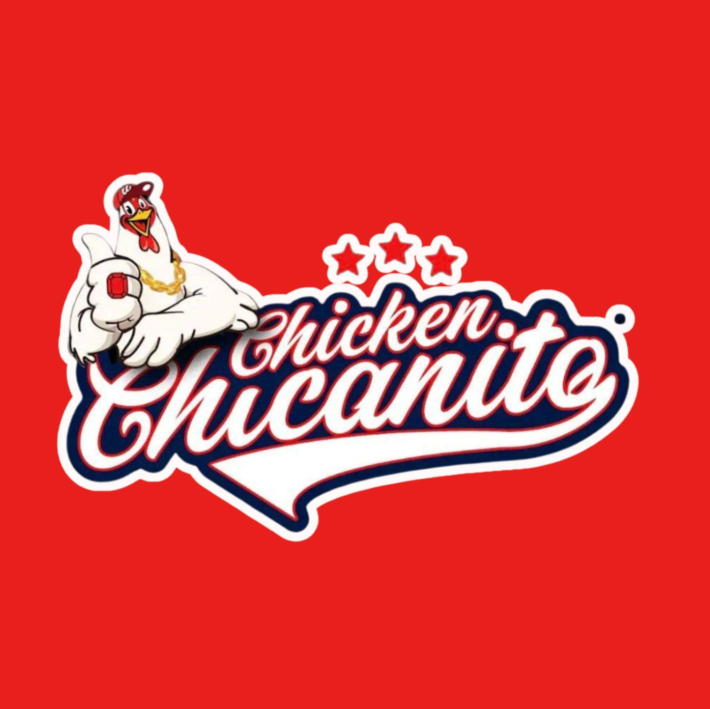
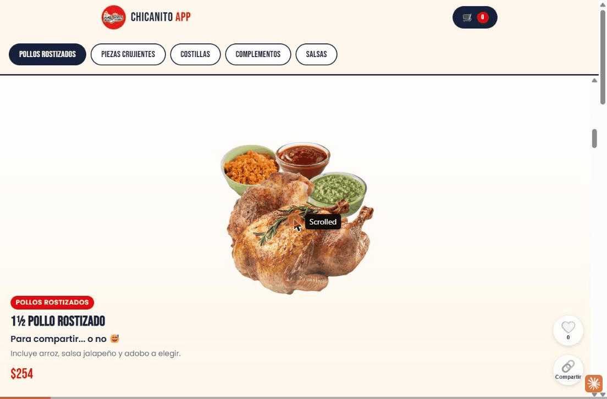

<div align="center">
  

  # Chicanito App

  **Ordering flow for a real fried-chicken business — checkout ends in a pre-filled WhatsApp message, not a payment form.**

  [](https://chicanito.app)
  
  
  
  

  [English](#-overview) · [Español](#-resumen)
</div>

---

<div align="center">
  
</div>

---


## 🇬🇧 Overview

Chicanito App is the ordering experience for **Chicken Chicanito**, a real, currently-operating restaurant. Customers browse the menu as a full-screen, swipeable, TikTok-style feed, build a cart, and confirm — checkout hands off to a **pre-filled WhatsApp message** sent straight to the business, instead of a traditional payment/checkout backend. It's installable as a PWA, has its own splash screen and animations, and every order is persisted to a database with an internal ops dashboard for the team.

It's live, in daily use, not a tutorial project.

### Live demo
**[chicanito.app](https://chicanito.app)**

### Key features

- 🎬 **Full-screen swipeable menu feed** — one product per screen, scroll-snap, heart-to-like, double-tap, native share
- 💬 **WhatsApp-native checkout** — no payment backend required; generates a formatted order message and opens WhatsApp directly to the business number
- 📱 **Installable PWA** — custom splash screen, circular app icons cropped to blend with Android's native splash, standalone display mode
- 🗄️ **Order persistence + internal dashboard** — every order saved to Postgres in the background (never blocks the WhatsApp handoff if the DB write fails), token-gated `/dashboard.html` for the team to see and update order status
- 🎉 **Micro-interactions** — fly-to-cart animation, cart bounce, tap feedback, bouncy modal/drawer transitions, confetti on order confirmation
- 🚚 **Real business logic for shipping** — delivery cost isn't a fixed number (depends on the actual driver), so the UI communicates "por confirmar" instead of a misleading flat fee
- 💳 **Mercado Pago integration, wired but gated** — serverless payment endpoints exist and work, held behind a feature flag until the business is ready to turn card payments on

### Why vanilla JS, no framework?

This is a deliberate choice, not a limitation — the app needed to ship fast, run fast on low-end phones over data connections in Mexico, and not carry a build step. No React/Vue, no bundler: plain HTML/CSS/JS served directly, deployed as static files + Vercel serverless functions for the few things that need a server (order persistence, Mercado Pago, dashboard auth).

### Tech stack

| Layer | Choice |
|---|---|
| Frontend | Vanilla JavaScript, CSS, HTML — no framework, no build step |
| Hosting | Vercel (static + serverless functions), custom domain |
| Backend | Vercel Serverless Functions (`api/`) |
| Database | Neon Postgres (serverless HTTP driver, `@neondatabase/serverless`) |
| Payments | Mercado Pago (integrated, currently feature-flagged off) |
| Checkout | WhatsApp deep link (`wa.me`) with a formatted order message |
| PWA | Web App Manifest, custom icons, offline-ready splash |

### Project structure

```
App/
├── index.html          # swipeable menu feed
├── checkout.html        # delivery info + order summary
├── confirmacion.html    # order confirmation, confetti, WhatsApp handoff
├── dashboard.html        # internal ops dashboard (token-gated)
├── js/
│   ├── menu.js           # product/variant data
│   ├── home.js           # feed rendering, swipe/like/share
│   ├── cart.js            # cart state
│   ├── checkout.js        # checkout flow
│   ├── shipping.js        # delivery cost rules
│   ├── whatsapp.js         # order → WhatsApp message formatting
│   ├── transitions.js      # page transition animations
│   └── dashboard.js         # dashboard data + status updates
├── api/                # Vercel serverless functions
│   ├── crear-pedido.js      # persist order to Postgres
│   ├── actualizar-pedido.js  # update order status (dashboard)
│   ├── pedidos.js             # list orders (token-gated)
│   ├── crear-preferencia.js    # Mercado Pago checkout preference
│   └── mp-status.js             # Mercado Pago payment status
├── assets/             # brand, icons, menu photography
└── tools/              # PowerShell image-processing scripts (bg removal, icon cropping)
```

### Running locally

No build step, no Node required for the frontend. A tiny Perl static file server is included:

```bash
perl serve.pl
# serves the app on http://localhost:8081
```

The `api/` serverless functions require Vercel's dev environment (and env vars `DATABASE_URL`, `DASHBOARD_TOKEN`, Mercado Pago credentials) to run locally — in day-to-day development they're tested against the live Vercel deployment instead.

### A few technical details worth calling out

- **Nested scroll-snap for the TikTok-style feed** — the feed uses its own isolated scroll container (`overflow-y: scroll; scroll-snap-type: y mandatory`) so the snap behavior doesn't fight with normal page scroll below it. A single page-wide snap zone caused the scroll to bounce back to the last card whenever it hit non-snapping content.
- **Android's native PWA splash screen can't be suppressed** while keeping `display: standalone` — instead of fighting it, the icon and `background_color` were designed to visually blend with the app's own custom splash screen.
- **Delivery cost as an honest "unknown"** rather than a fixed number that would misrepresent the real cost until a driver is assigned.

### Roadmap

- In-app AI assistant for customers
- AI-driven sales analysis over the orders table

---

## 🇲🇽 Resumen

Chicanito App es la experiencia de pedidos de **Chicken Chicanito**, un negocio real en operación. Los clientes navegan el menú como un feed vertical estilo TikTok (una foto por pantalla, swipe, corazón para agregar al carrito), arman su carrito y al confirmar el pedido se genera un **mensaje de WhatsApp pre-llenado** que se envía directo al número del negocio — sin backend de pagos tradicional. Es instalable como PWA, tiene su propia pantalla de splash y animaciones, y cada pedido se guarda en base de datos con un dashboard interno para el equipo.

Está en producción, en uso diario — no es un proyecto de práctica.

### Demo en vivo
**[chicanito.app](https://chicanito.app)**

### Funcionalidades clave

- 🎬 Feed de menú full-screen tipo TikTok, con scroll-snap, like y compartir nativo
- 💬 Checkout nativo por WhatsApp — sin backend de pagos, genera el mensaje formateado y abre WhatsApp directo al negocio
- 📱 PWA instalable, con splash screen e íconos propios
- 🗄️ Persistencia de pedidos en Postgres + dashboard interno protegido por token
- 🎉 Animaciones: vuelo al carrito, confeti al confirmar, transiciones entre pantallas
- 🚚 Envío variable comunicado como "por confirmar" en vez de una tarifa fija engañosa
- 💳 Integración con Mercado Pago lista pero apagada hasta que el negocio la active

### Stack técnico

JavaScript/CSS/HTML puro (sin framework, sin build step), hosteado en Vercel con dominio propio, funciones serverless para lo que sí necesita servidor (guardar pedidos, Mercado Pago, autenticación del dashboard), y Neon Postgres como base de datos.

### Correr en local

```bash
perl serve.pl
# sirve la app en http://localhost:8081
```

---

## License / Uso

This is proprietary code for a real, operating business — shared here as a portfolio/case-study reference, not under an open-source license. Please don't reuse or redistribute without asking.

Código propietario de un negocio real en operación, compartido aquí como referencia de portafolio. No reutilizar sin permiso.

---

<div align="center">
  

  <sub>¡Muy facilito, rapidito y sabrosito! 🐔</sub>

  Built by **[Miguel Enrique Portilla](https://github.com/MiguelEnriquePortilla)**

</div>
